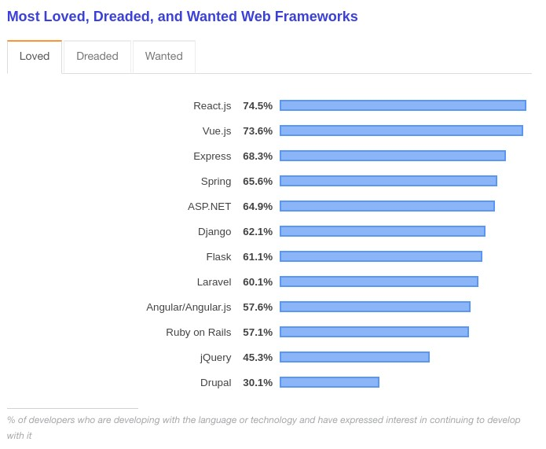
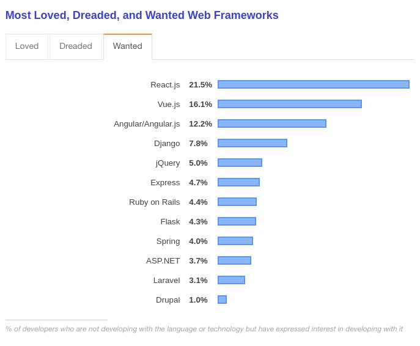
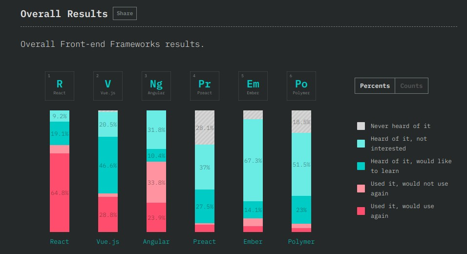

# note-app-front-end

## The mission:
A team of back end developers just created a note app api but haven't gotten around to finish it yet. It is now up to you to use their API. Our company is very modern so we want you to use a framework. Good candidates are React, Angular or Vue.js This should be a single page app.

## Sprints

### Sprint 0: Introduction

**Start by knowing what technology is out there. Make a quick overview of the front end frameworks that are out there and write down the pros and cons of each. Then show them to your manager ;)**

|                                   | Angular     | React          | Vue                               |
|---------------------------------- |-------------|----------------|-----------------------------------|
|initial release                    | 2010        | 2013           | 2014                              |
|developed & maintained by          | google      | facebook       | group of open source contributors |
|official website                   | angular.io  | reactjs.org    | vuejs.org                         |
|used by                            | google, wix | facebook, uber | alibaba, gitlab                   |
|popularity (github stars 17/12/18) | 43546       | 117687         | 122284                            |
|size                               | 500+ KB     | 100 KB         | 80 KB                             |

The results of [Stack Overflow’s annual Developer Survey](https://insights.stackoverflow.com/survey/2019#overview) state that:
**React.js and Vue.js are both the most wanted and most loved web frameworks by developers.**

[Mosh Hamedani's](https://programmingwithmosh.com/) summarizes the comparison in a nice manner:
> JavaScript frameworks and libraries are evolving everyday. There is a lot to look forward to in the coming years. 
> With respect to 2019, React is still at the top. And learning React will help you find a front-end job. 
> Vue is upcoming, but it is young. 
> Finding a job with Vue skills may take a while. 
> Angular is still out there, and used by many companies and enterprises. 
> Finding jobs with Angular skills will also be easy, but it is losing its spark. 
> Developers are not eager to learn Angular, as much as much as they would like to learn React or Vue.

**For this assignment I am going to work with react.js.**

### Sprint 1: Tooling
- [x] Installed [Node.JS and npm](https://linuxize.com/post/how-to-install-node-js-on-ubuntu-18.04/) through the terminal - make sure you get a npm version higher than 5.2 to be able to use npx later on.
- [x] Added React Developer Tools as Google Chrome extension
- [x] Use [create-react-app](https://github.com/facebook/create-react-app) to generate an application within my folder through the visual studio code terminal : " npx create-react-app note-app-front-end " 

https://www.codecademy.com/articles/react-setup-i

### Sprint 2: List page
When arrive on the main page (note list page), we should see all the differents notes that are in the database.

### Sprint 3: Delete and edit
For each note I want the possiblity to delete it or edit it. So maybe use font awesome to have a nice cross or pen icon to make it look nice. Either do it in the list, or when you open a note. If the user clicks delete, there should be some kind of popup asking the user if they are sure they wants to delete the note. If they want to edit a note, there should be a modal (look it up) to edit the note.

--> https://www.w3schools.com/w3css/w3css_modal.asp use Modal for editing

### Sprint 4: Add a new note
On the list page there should be a big button that indicates you can add a new note. When that button is clicked, a modal should open where a user can create a new note. It should also be possible ofcourse to cancel the modal.

### Sprint 5:
Make it mobile friendly.

### Possible extras
- Make it a real PWA
- Add login/register to your API
- Then add front end support
- Let the user choose a theme
- Start making up your own things: good developers should have input into what they make
- Discuss it with someone else, working in group is important
